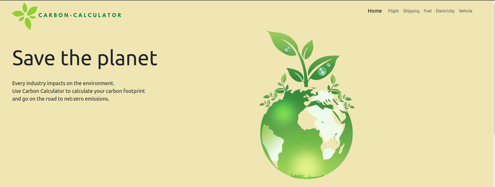

# Carbonified

Carbonified is a platform that focuses on climate consciousness. The platform allows users to make estimates of carbon emissions based on a specific situation, device or automobile machine. The estimates are calculated using the API provided by [Carbon Interface](https://docs.carboninterface.com/#/?id=introduction)
<!-- <video width="320" height="240" controls> -->
  <source src="./homepage.webm" type="video/webm">
    
</video>


## Minimum Viable Product
The following requirements must be delivered in order to consider the submission as complete:

- Home Page: When a user first opens the application, they should be greeted with a page that has information about what the application aims to do.
- Listing of estimates: Users should be able to choose from a list of estimates to calculate.
- Estimate data: Users should be able to use the estimates API provided to get actual estimate data.
- User Interface: Users should be able to interact with cool CSS animations on the User interface.
- Data Visualization: Estimates should be stored in a table for later analysis. A graph should be provided to view the trend of estimates e.g electricity.

  #### vehicles estimate component


  #### fuel estimate component
  

#### Electricty estimate component
   
#### Flight estimate component
  

 #### Shipping estimate component


## Installation
1. Clone the repository

``` bash 
git clone https://github.com/richard200/project-carbon-calculator
```

2. Install the dependencies

``` bash
npm install
```
3. install router dom

```bash
npm install react-router-dom
```
3. Start the development server

``` bash
npm start
```
## Built With
- React
- CSS
- JavaScript
- API from Carbon Interface

## Contributing

- If you wish to contribute to the project, please follow the steps below:
1. Fork the repository
2. Create a new branch with a descriptive name
3. Make your changes and commit them
4. Submit a pull request

## Authors

1)  [rose-kiragu](https://github.com/Rose534)
2)  [marvin-mathai](https://github.com/MathaiMarvin)
3)  [richard.ngeti](https://github.com/richard200)
4)  [stephen-nene](https://github.com/stephen-nene)

<!-- (https://avatars.githubusercontent.com/u/52774316?s=120&v=4 ) -->

<!-- 1.</img>
2.</img>
3.</img>
4.</img> -->


## Acknowledgments
1. [Carbon Interface](https://docs.carboninterface.com/#/?id=introduction) for providing the API used in this project
2. [OpenAI](https://openai.com/) for providing the language model used in this project

## License

This project is licensed under the MIT License 